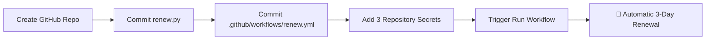
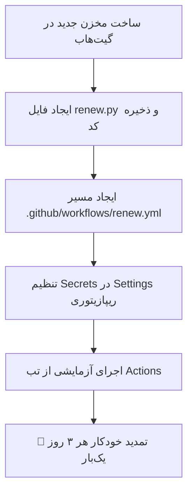

<p align="center">
  
</p>

<div align="center">

# ⚡ Panel - VPS
### 🚀 Modern, Lightweight & High-Performance Multi-Protocol Web Panel
**Crafted with ❤️ by Parham - 01**

<br/>

<!-- Language Switcher Buttons -->
<p align="center">
  <a href="#-english">
    
  </a>
  &nbsp;&nbsp;
  <a href="#-فارسی-persian">
    
  </a>
</p>

<!-- Technology & Project Badges -->
<p align="center">
  
  
  
  
  
  
</p>

<!-- Quick Navigation Bar -->
<p align="center">
  <a href="#-about-the-project">📖 About</a> • 
  <a href="#-key-features">✨ Features</a> • 
  <a href="#-how-to-run">🚀 Quick Start</a> • 
  <a href="#️-unlimited-auto-renew-on-katabump">♾️ Auto-Renew</a> • 
  <a href="#-project-structure">📁 Structure</a> • 
  <a href="#-community--support">📣 Community</a>
</p>

</div>

---

<br/>

<!-- ========================================================================================= -->
<!--                                    ENGLISH SECTION                                        -->
<!-- ========================================================================================= -->

<div dir="ltr" align="left">

# 🇬🇧 English

## 📖 About the Project

**Panel - VPS** is an ultra-lightweight, standalone control panel designed for managing and deploying multi-protocol proxy configurations on **Katabump free containers** as well as standard **Linux VPS** environments.

> [!TIP]
> **Optimized for Katabump Free Tier:** No complex databases or bloated dependencies. Simply upload two files and your proxy management suite is instantly operational!

---

## ✨ Key Features

<table>
  <thead>
    <tr>
      <th width="30%">Feature</th>
      <th width="70%">Description</th>
    </tr>
  </thead>
  <tbody>
    <tr>
      <td>🎨 <b>Dark Glass UI</b></td>
      <td>State-of-the-art modern dark glassmorphism dashboard with smooth animations.</td>
    </tr>
    <tr>
      <td>🔗 <b>Multi-Protocol Support</b></td>
      <td>Full support for <code>VLESS</code>, <code>Hysteria 2</code>, <code>Trojan</code>, <code>Shadowsocks</code>, <code>WireGuard</code>, and custom subscription links.</td>
    </tr>
    <tr>
      <td>📱 <b>Fully Responsive</b></td>
      <td>Seamless experience across desktop, tablet, and mobile browsers.</td>
    </tr>
    <tr>
      <td>⚡ <b>One-File Deployment</b></td>
      <td>Zero database required. Simply drop <code>index.js</code> + <code>package.json</code> and run.</td>
    </tr>
    <tr>
      <td>🔄 <b>Real-Time Telemetry</b></td>
      <td>Live monitoring of server uptime, active listening port, host IP, and core daemon health.</td>
    </tr>
  </tbody>
</table>

---

## 🚀 How to Run

### 1️⃣ System Requirements
* **Node.js** `v18.0.0` or higher
* A **Katabump** container **or** any **Linux VPS** (Ubuntu, Debian, CentOS, etc.)

### 2️⃣ Upload Files
Transfer the following core files to your server working directory (e.g., `/home/container/` on Katabump):

```text
📁 /home/container/
├── 📜 index.js
└── 📜 package.json
```

### 3️⃣ Automatic Startup & Access
Once uploaded, Node.js starts the panel **automatically**.

> [!NOTE]
> Please wait **5 to 10 seconds** for Node.js to initialize dependencies and spin up the internal HTTP web server.

Inspect your server console logs. You will see the panel access address:

```bash
http://YOUR_SERVER_IP:PORT/parham-confing
```

Open this address in your browser — your panel is online and ready!

> [!TIP]
> No complicated terminal commands required. Simply **Upload ➔ Wait ➔ Open Panel**.

---

## ♾️ Unlimited (Auto-Renew on Katabump)

Katabump free containers require manual server renewal roughly every **4 days**. You can completely automate this renewal process via a free **GitHub Actions** cron workflow.

### 📄 Automation Codes
All pre-configured scripts and workflows are ready inside:
👉 **[Auto-Renew-Guide.txt](Auto-Renew-Guide.txt)**

*(Each code snippet is labeled with its exact target filename).*

### 📂 Required Repository Files

| File Name | Target Path in Repository | Description |
| :--- | :--- | :--- |
| `renew.py` | `renew.py` | Python automation renewal script |
| `renew.yml` | `.github/workflows/renew.yml` | GitHub Actions workflow trigger |

### 🛠️ Step-by-Step Setup



1. **Create Repository:** Create a new GitHub repository (can be set to **Private** for security).
2. **Add `renew.py`:** Create `renew.py` in the root directory. Copy the code under `renew.py` from [Auto-Renew-Guide.txt](Auto-Renew-Guide.txt) and commit.
3. **Add `renew.yml`:** Create the path `.github/workflows/renew.yml`. Copy the workflow YAML code from the guide and commit.
4. **Configure Secrets (Crucial):**
   Navigate to: **Settings** ➔ **Secrets and variables** ➔ **Actions** ➔ **New repository secret**
   
   Add the following three secrets:

   | Secret Name | Value to Enter |
   | :--- | :--- |
   | `KATABUMP_EMAIL` | Your Katabump account login email |
   | `KATABUMP_PASSWORD` | Your Katabump account login password |
   | `SERVER_ID` | Your server ID from the server dashboard URL on Katabump |

5. **Test Workflow:**
   Open the **Actions** tab ➔ select **Parham Confing Auto Renew** ➔ click **Run workflow**.  
   If configured properly, the workflow will run automatically every **3 days** to keep your server alive.

> [!IMPORTANT]
> Official Katabump Portal: [control.katabump.com](https://control.katabump.com)

---

## 📁 Project Structure

```bash
📦 Panel-VPS
 ┣ 📜 index.js                  # Main server entry point & core logic
 ┣ 📜 package.json              # Project dependencies and scripts
 ┣ 📜 Auto-Renew-Guide.txt      # Auto-renewal script instructions & code
 ┗ 📁 banner
    ┗ 🖼️ banner.png             # UI branding banner
```

---

## 🛠️ Pro Tips & Troubleshooting

- 🔄 **Stale Browser Cache:** After updates or edits, perform a **Hard Refresh** (`Ctrl + Shift + R` or `Cmd + Shift + R`).
- 🛡️ **Connection Issues:** If the panel does not open, verify that your VPS firewall (`ufw` or `iptables`) allows the assigned port.
- 📋 **Accessing Configs:** Generated proxy configurations and subscriptions are located in the **Configs** and **Subs** tabs.
- 📲 **Client Compatibility:** Tested and fully compatible with **v2rayN**, **v2rayNG**, **Hiddify**, **Clash Meta**, and **Sing-box**.

---

## 📣 Community & Support

Join our official community for continuous updates, proxy configs, and troubleshooting:

<p align="center">
  <a href="https://t.me/parham_ste01" target="_blank">
    
  </a>
  &nbsp;&nbsp;&nbsp;&nbsp;
  <a href="https://t.me/+SchgZ4s1dGU4N2Y0" target="_blank">
    
  </a>
</p>

<div align="center">

| Community | Direct Link |
| :--- | :--- |
| 📢 **Official Channel** | [t.me/parham_ste01](https://t.me/parham_ste01) |
| 💬 **Support Group** | [t.me/+SchgZ4s1dGU4N2Y0](https://t.me/+SchgZ4s1dGU4N2Y0) |

</div>

</div>

<br/>
<br/>

---

<!-- ========================================================================================= -->
<!--                                    PERSIAN SECTION                                        -->
<!-- ========================================================================================= -->

<div dir="rtl" align="right">

# 🇮🇷 فارسی (Persian)

## 📖 درباره پروژه

**Panel - VPS** یک کنترل پنل سبک، سریع و تک‌فایلی است که برای مدیریت و راه‌اندازی آسان کانفیگ‌های پروکسی چند پروتکله روی **سرورهای رایگان Katabump** و انواع **سرور مجازی لینوکس (VPS)** طراحی و بهینه‌سازی شده است.

> [!TIP]
> **طراحی اختصاصی برای سرورهای کاتابامپ:** نیاز به هیچ دیتابیس سنگین یا ابزار اضافه‌ای نیست؛ فقط با آپلود دو فایل، یک پنل وب با ظاهر مدرن و امکانات کامل در اختیار شما قرار می‌گیرد.

---

## ✨ امکانات و ویژگی‌های برجسته

<div dir="rtl">

| قابلیت | توضیحات |
| :---: | :--- |
| 🎨 **طراحی شیشه‌ای (Glass UI)** | رابط کاربری تیره، مدرن، جذاب و شفاف با افکت‌های بلور نئونی |
| 🔗 **چند پروتکل همزمان** | پشتیبانی کامل از `VLESS`، `Hysteria 2`، `Trojan`، `Shadowsocks`، `WireGuard` و لینک ساب |
| 📱 **کاملاً ریسپانسیو** | واکنش‌گرایی بالا و بهینه‌سازی شده برای نمایش در گوشی‌های موبایل و کامپیوتر |
| ⚡ **راه‌اندازی تک‌فایلی** | اجرای مستقیم تنها با آپلود دو فایل `index.js` و `package.json` |
| 🔄 **مانیتورینگ وضعیت زنده** | نمایش لحظه‌ای مدت زمان روشن بودن (Uptime)، مشخصات هاست، پورت و سلامت هسته‌ها |

</div>

---

## 🚀 راهنمای سریع راه‌اندازی

### ۱️⃣ پیش‌نیازها
* **Node.js** نسخه **۱۸ به بالا**
* کانتینر **Katabump** یا هر نوع **VPS لینوکس** (اوبونتو، دبیان، سنت‌او‌اس و...)

### ۲️⃣ آپلود فایل‌ها
دو فایل اصلی پروژه را در مسیر اصلی سرور خود (مانند مسیر `/home/container/` در کاتابامپ) آپلود کنید:

```text
📁 /home/container/
├── 📜 index.js
└── 📜 package.json
```

### ۳️⃣ اجرای خودکار و ورود به پنل
پس از آپلود، پنل به‌صورت **کاملاً خودکار** اجرا می‌شود.

> [!NOTE]
> لطفاً **۵ الی ۱۰ ثانیه** منتظر بمانید تا Node.js پکیج‌ها را شناسایی کرده و وب‌سرور آماده به کار شود.

سپس در کنسول سرور خود، آدرس اختصاصی پنل را مشاهده خواهید کرد (مشابه نمونه زیر):

```bash
http://YOUR_SERVER_IP:PORT/parham-confing
```

آدرس بالا را در مرورگر سیستم یا موبایل خود باز کنید؛ پنل آماده استفاده است! ✅

> [!TIP]
> نیازی به وارد کردن هیچ دستور پیچیده‌ای در ترمینال نیست؛ **آپلود فایل ➔ چند ثانیه صبر ➔ باز کردن پنل**.

---

## ♾️ نامحدودسازی (تمدید خودکار سرور رایگان کاتابامپ)

سرورهای رایگان Katabump معمولاً هر **۴ روز یک‌بار** نیاز به زدن دکمه تمدید (Renew) دارند. با استفاده از این ترفند و از طریق **GitHub Actions**، می‌توانید این فرآیند را کاملاً رایگان و خودکار کنید تا سرور شما همیشه فعال بماند.

### 📄 کدهای آماده تمدید
تمامی کدهای لازم به‌صورت آماده و تفکیک‌شده در فایل زیر قرار دارند:  
👉 **[Auto-Renew-Guide.txt](Auto-Renew-Guide.txt)**

*(بالای هر بخش از کد، نام دقیق فایلی که باید بسازید مشخص شده است).*

### 📂 فایل‌های مورد نیاز در مخزن گیت‌هاب

| نام فایل | مسیر فایل در ریپازیتوری | وظیفه فایل |
| :---: | :--- | :--- |
| `renew.py` | `renew.py` | اسکریپت پایتون جهت ورود و تمدید خودکار اکانت |
| `renew.yml` | `.github/workflows/renew.yml` | فایل زمان‌بندی خودکار ابزار GitHub Actions |

### 🛠️ مراحل راه‌اندازی گام‌به‌گام



1. **ساخت ریپازیتوری جدید:** در اکانت گیت‌هاب خود یک ریپازیتوری جدید بسازید (می‌تواند برای امنیت بیشتر روی حالت **Private** باشد).
2. **ساخت فایل `renew.py`:** در صفحه اصلی ریپازیتوری، فایل `renew.py` را ایجاد کنید. کد بخش مربوطه را از [Auto-Renew-Guide.txt](Auto-Renew-Guide.txt) کپی کرده و ذخیره (Commit) نمایید.
3. **ساخت فایل `renew.yml`:** مسیر `.github/workflows/renew.yml` را بسازید و کد ورک‌فلو را از فایل راهنما درون آن قرار دهید.
4. **تنظیم متغیرهای امنیتی (Secrets):**  
   به بخش زیر در ریپازیتوری گیت‌هاب بروید:  
   **Settings** ➔ **Secrets and variables** ➔ **Actions** ➔ **New repository secret**  
   
   سه سکرت زیر را تک‌به‌تک اضافه کنید:

   | نام Secret | مقداری که باید وارد کنید |
   | :--- | :--- |
   | `KATABUMP_EMAIL` | ایمیل ثبت‌نامی شما در سایت کاتابامپ |
   | `KATABUMP_PASSWORD` | رمز عبور اکانت کاتابامپ شما |
   | `SERVER_ID` | شناسه سرور (در آدرس URL صفحه سرور در پنل کاتابامپ قابل مشاهده است) |

5. **تست اولیه:**  
   وارد تب **Actions** شوید ➔ گزینه **Parham Confing Auto Renew** را انتخاب کنید ➔ روی دکمه **Run workflow** کلیک کنید.  
   پس از اجرای موفق، از این پس سرور شما هر **۳ روز یک‌بار** به‌صورت کاملاً خودکار تمدید می‌شود.

> [!IMPORTANT]
> آدرس ورود به پنل اصلی کاتابامپ: [control.katabump.com](https://control.katabump.com)

---

## 📁 ساختار فایل‌های پروژه

```bash
📦 Panel-VPS
 ┣ 📜 index.js                  # فایل اصلی سرور و هسته پردازشی
 ┣ 📜 package.json              # مشخصات پروژه و پیش‌نیازها
 ┣ 📜 Auto-Renew-Guide.txt      # راهنما و کدهای آماده تمدید خودکار
 ┗ 📁 banner
    ┗ 🖼️ banner.png             # تصویر بنر گرافیکی سربرگ
```

---

## 🛠️ نکات کلیدی و رفع اشکال

* 🔄 **عدم نمایش تغییرات:** بعد از انجام هرگونه ویرایش یا آپدیت، کش مرورگر خود را با کلیدهای میانبر `Ctrl + Shift + R` خالی کنید (Hard Refresh).
* 🛡️ **عدم باز شدن پنل:** در صورتی که پنل باز نشد، مطمئن شوید پورت مورد نظر در فایروال سرور (`ufw` یا `iptables`) باز است.
* 📋 **دسترسی به کانفیگ‌ها:** تمامی کانفیگ‌های تولیدشده و لینک‌های اشتراک (Sub) در تب‌های اختصاصی **Configs** و **Subs** قرار دارند.
* 📲 **کلاینت‌های تست‌شده:** سازگار با نرم‌افزارهای محبوب نظیر **v2rayN**، **v2rayNG**، **Hiddify**، **Clash Meta** و **Sing-box**.

---

## 📣 کانال و گروه پشتیبانی تلگرام

برای دریافت جدیدترین آپدیت‌ها، دریافت کانفیگ و پاسخ به سوالات به کامیونیتی ما بپیوندید:

<p align="center">
  <a href="https://t.me/parham_ste01" target="_blank">
    
  </a>
  &nbsp;&nbsp;&nbsp;&nbsp;
  <a href="https://t.me/+SchgZ4s1dGU4N2Y0" target="_blank">
    
  </a>
</p>

<div align="center">

| بخش | لینک مستقیم |
| :---: | :--- |
| 📢 **کانال رسمی** | [t.me/parham_ste01](https://t.me/parham_ste01) |
| 💬 **سوپرگروه گفتگو و رفع اشکال** | [t.me/+SchgZ4s1dGU4N2Y0](https://t.me/+SchgZ4s1dGU4N2Y0) |

</div>

</div>

<br/>

---

<!-- Footer -->
<p align="center">
  <sub>⚡ Crafted with passion by <b>Parham - 01</b> • Designed for the Open Source Community ⚡</sub><br/>
  <sub>⭐ If you found this project helpful, please give it a star! ⭐</sub>
</p>
